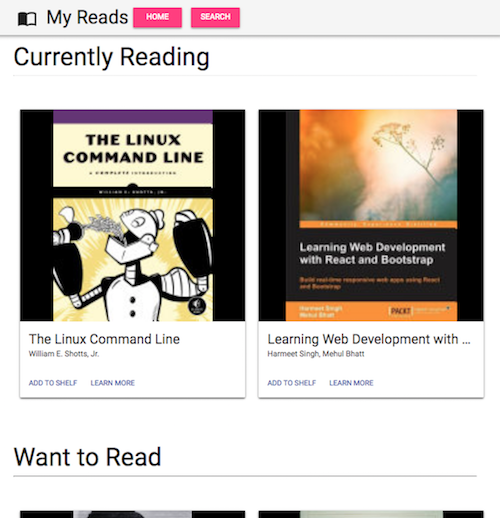
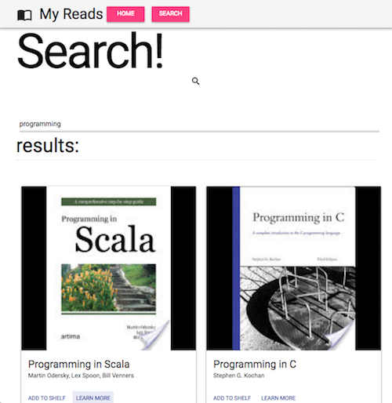
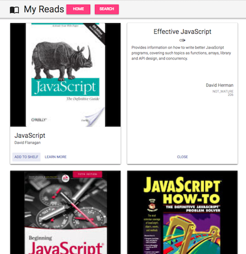

# MyReads

A project built in fulfillment of Udacity's React Developer nanodegree program.
Lets users view lists of books organized in several categories: books they are currently reading, books they would like to read in the future and books that they have already read. Books can be moved between categories. A search feature allows the User to add additional books to any of these categories.

Uses React in combo with MaterialUI to create the views and a custom backend with limited search query functionality.

Bootstrapped with [create-react-app](https://github.com/facebookincubator/create-react-app).

Based on [this project template](https://github.com/udacity/reactnd-project-myreads-starter).

### Screens

(Home)



(Search)



(Book Details)




### Prerequisites

Running this project requires both [Node](https://nodejs.org/en/) and the [Yarn](https://code.facebook.com/posts/1840075619545360) package manager to be installed.


### Installing and Running *IMPORTANT*

After cloning the repo, `cd` into the `/ND01-MyReads` directory and run the command `yarn` or `yarn install`.
(NOTE: using `npm install` might result in some version-related bugs, possibly something with react-scripts. In development, I used `yarn` entirely and had no issues. Thus, if `npm i` result in issues, please try `yarn install` when setting up this project.)

To launch the development server run the command:
```
yarn start
```

Then go to `localhost:3000` in your browser to view the app.


## Deployment

This project is currently deployed to Github-Pages, accessible at:
https://uncleoptimus.github.io/ND01-MyReads

A cloned project already pushed to Github can be deployed with the command `yarn run deploy`


## Built With

* [React](https://facebook.github.io/react/)
* [MaterialUI (1.0.0 beta)](https://github.com/callemall/material-ui)


## Miscellaneous resource links

[Feature mind-map](https://www.mindmeister.com/891484248?t=TCN3DWrbpE)


## Authors

* **Andrew R Chen** - *Initial work* - [UncleOptimus](https://github.com/uncleoptimus)


## License

This project is licensed under the MIT License
